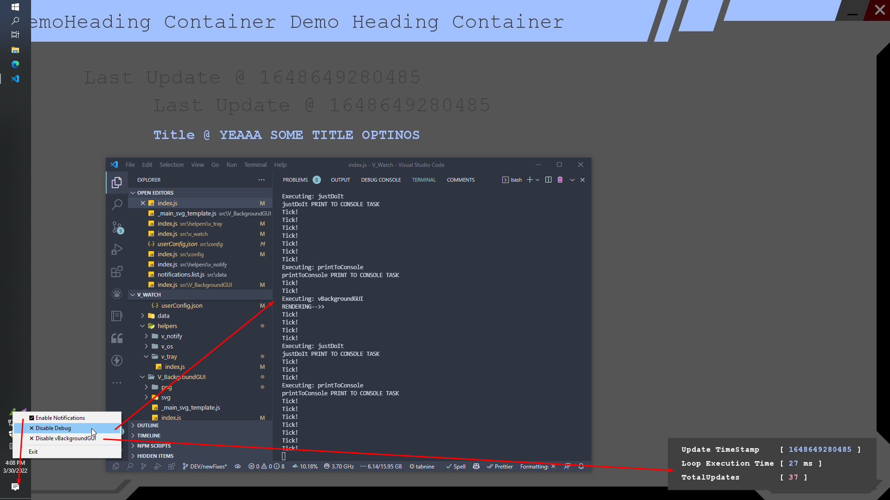
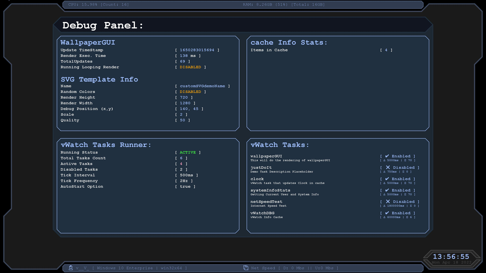

# v_watch
v_watch is hopefully gonna become useful OS Monitor[ing] tool based on Node.js

### 🙋‍♂️ What this does:

## - 🖼 wallpaperGUI : ⚠ ONLY WINDOWS ⚠  
1. Renders SVG with custom data.
2. Uses svg2img module to save JPG image from the render.
3. Runs PowerShell script to get that image set as OS Background Image.

## - ➿ V_Watch 
This is like a custom cron jobs. Will loop though the tasks and try to run them when needed or their "interval" has passed.  
> Here it is also used to drive wallpaperGUI even though it can run on its own.

## - 📑 V_Tray
This is actually using [windows-tray](https://github.com/AHgPuK/window-tray) to provide windows tray functionality that in this case can:
1. Enable/Disable Sending Notifications from the App by using Node Notifier module.  
2. Toggle Application Debug mode which means it's gonna start logging things to console.  
3. Toggle wallpaperGUI task in V_Watch so it runs or stops.  

## Example Showing Tray and Wallpaper
  

#

## Last Generated ImageWallpaperGUI :
